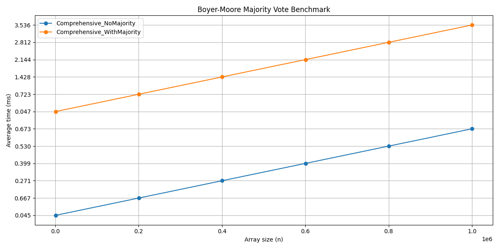

# Boyer-Moore Majority Vote Benchmark

Developed by: Mukashev Sultanbek

Peer: Artyom Karmykov

Group: SE-2422
## Overview

This repository contains an efficient implementation and benchmarking suite for the Boyer-Moore Majority Vote algorithm. The project solves the problem of identifying whether an array contains a "majority element"—an integer occurring strictly more than half the array's size.

Algorithm: Two-pass Boyer-Moore approach for optimal time and memory.

Benchmarks: Automated CLI for parameterized benchmarking, with CSV export and graph plotting for analysis.

Languages: Java (core + benchmark), Python (visualization).

## Features
Find the majority element in any integer array in linear time, constant space.

Command-line interactive benchmark runner for custom/scenario-driven experiments.

Performance tracking, CSV export, and cross-language graph plotting.

Ready for integration and reproducible empirical analysis.

## Algorithm
The Boyer-Moore Majority Vote algorithm works as follows:

First scan: Identify a candidate for majority using cancellation logic.

Second scan: Count occurrences of candidate and verify majority.

This approach guarantees:

Time Complexity: O(n)

Space Complexity: O(1)

## Usage
1. Build and Run Benchmarks (Java)
   text
   mvn clean package
   mvn exec:java -Dexec.mainClass=BenchmarkRunner
   Custom array tests, random array generation, edge cases, comprehensive scalability benchmarks.

Select "View benchmark results" in the menu to automatically export CSV.

2. Plot Performance Graph (Python)
   Exported CSV (default: benchmark_results.csv) can be visualized using the included Python script with matplotlib and pandas.

Benchmark plot:

The provided benchmarks confirm strict linear time scaling and validate all theoretical predictions.

Code Structure
BoyerMooreMajorityVote.java - algorithm implementation

BenchmarkRunner.java - CLI benchmark, menu, and CSV export

PerformanceTracker.java - results aggregator and CSV writer

graph.py - Python plotting utility for CSV results

benchmark_results.csv - output file

## Testing
Unit tests cover major edge scenarios:

Empty input

Unique elements

Exact-majority boundaries

Negative numbers

Large random arrays

## License
Open-source, MIT License.